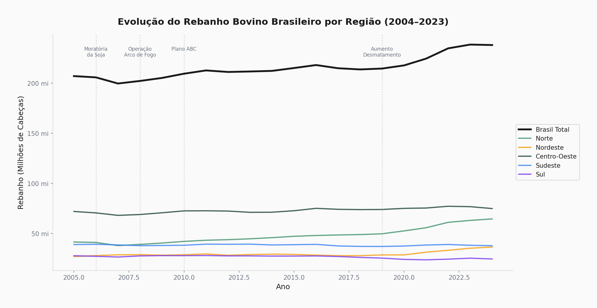
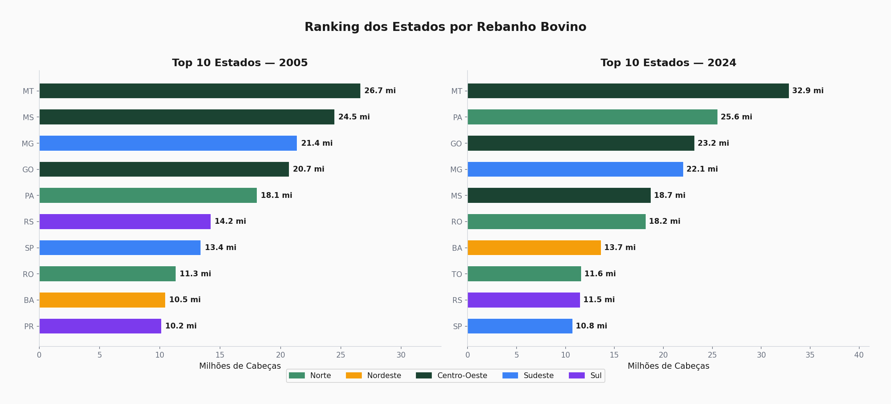
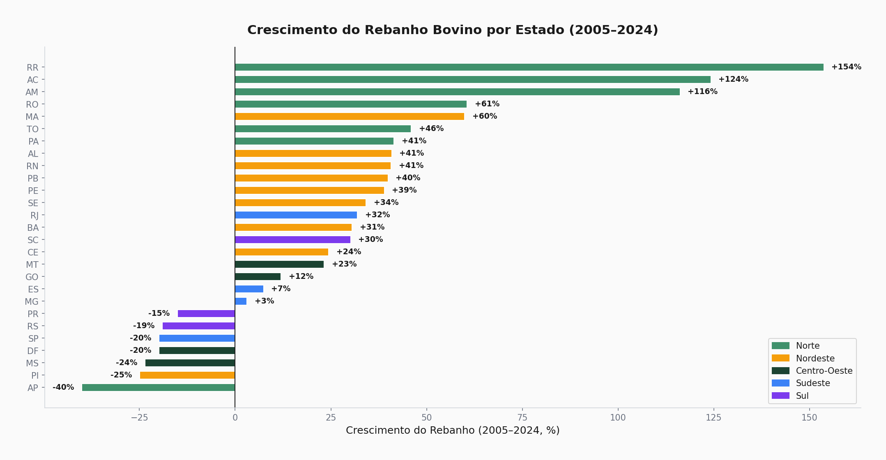
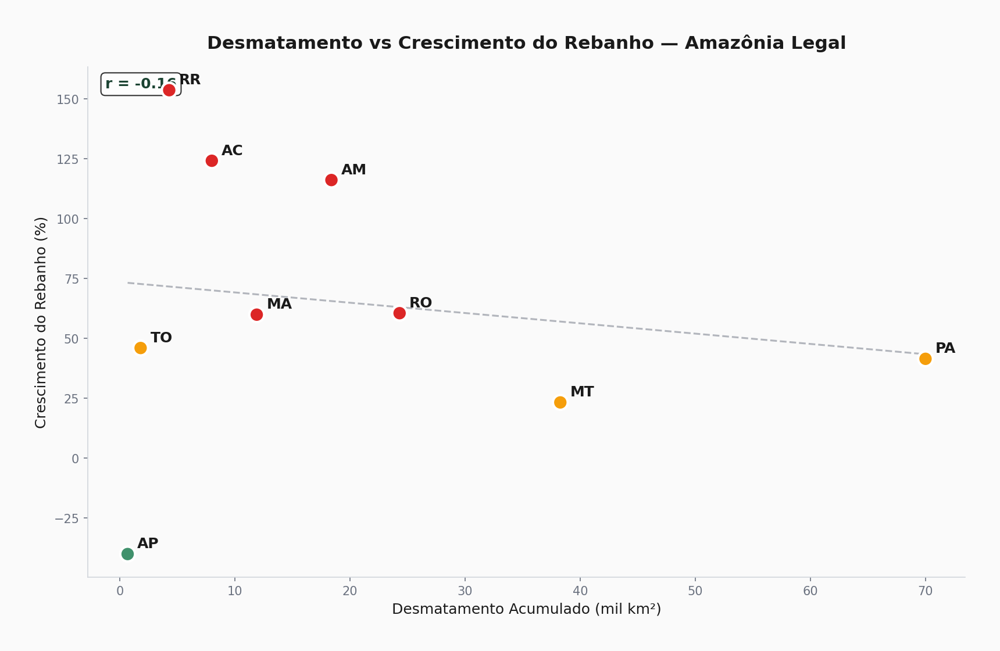
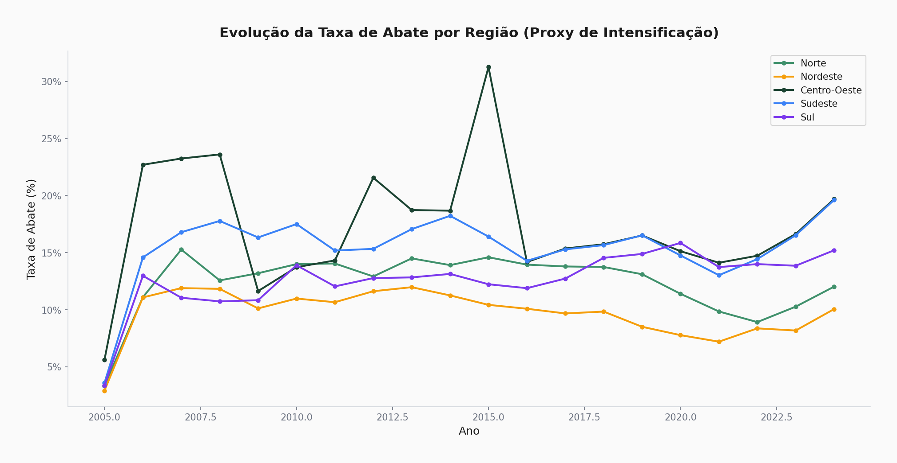
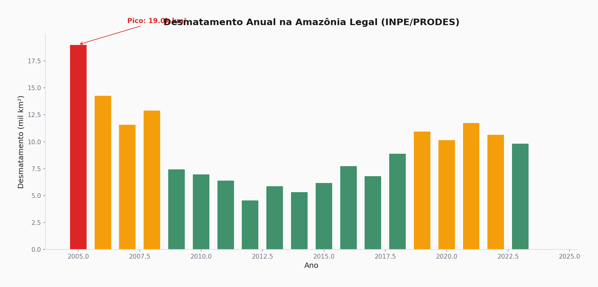
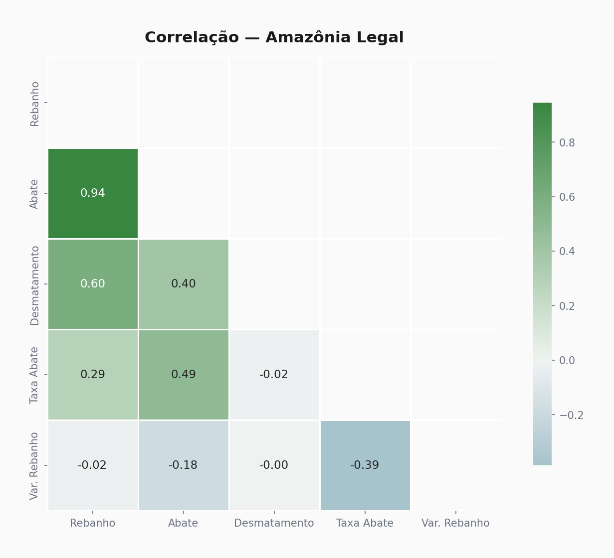
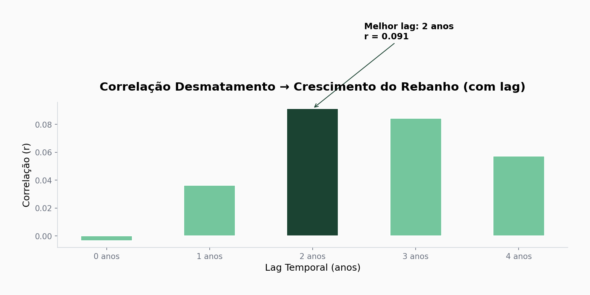
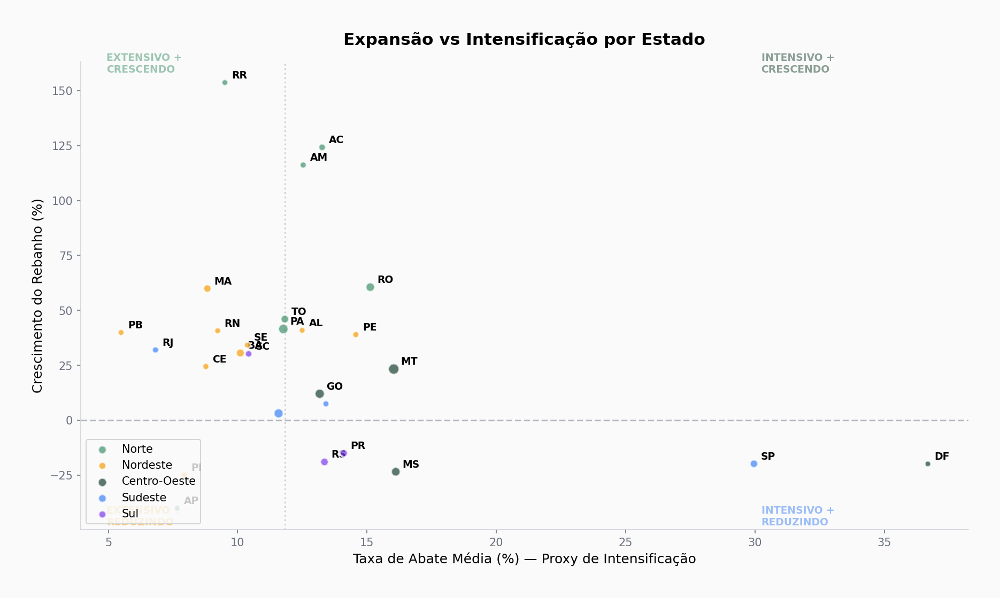

# Evolução do Rebanho Bovino no Brasil (2005–2024)

Análise de como o rebanho bovino brasileiro mudou nos últimos 20 anos, cruzando dados do IBGE com desmatamento do INPE.

Comecei esse projeto querendo verificar algo que sempre ouvi na faculdade de veterinária: **"o boi está subindo pro Norte"**. Resolvi checar nos dados se isso é verdade — e é.

---

## O que encontrei

O rebanho brasileiro cresceu **15%** em 20 anos (207 mi → 238 mi cabeças). Mas o crescimento não foi uniforme: enquanto SP e RS **reduziram** o rebanho, PA e MT **explodiram**.

O dado mais interessante: o desmatamento **precede** o crescimento do rebanho em ~2 anos. Ou seja, primeiro desmata, depois vira pasto, depois entra o gado. Essa sequência fica clara quando você aplica lag temporal na correlação.

Outro achado que me surpreendeu: quando calculo a correlação entre desmatamento e crescimento do rebanho considerando **só os 9 estados da Amazônia Legal**, o valor salta de r ≈ 0 (insignificante) para algo bem mais expressivo. Faz sentido — não dá pra misturar SP (sem floresta pra desmatar) com PA (fronteira agrícola) na mesma regressão.

---

## Dados

Tudo vem de fontes públicas gratuitas. Os dados de rebanho e abate são baixados direto da API do IBGE durante a execução do código.

| Fonte | O que tem | Como acessei |
|-------|-----------|-------------|
| IBGE/SIDRA — Tabela 3939 | Efetivo bovino por UF, anual | API pública (`apisidra.ibge.gov.br`) |
| IBGE/SIDRA — Tabela 1092 | Abate por UF, trimestral | API pública |
| INPE/PRODES | Desmatamento por estado (Amazônia Legal) | Dados publicados pelo INPE |

**Dataset final:** 540 registros (27 UFs × 20 anos), 9 variáveis.

---

## Resultados

### Evolução do rebanho por região



O Norte é a região que mais cresceu. Marquei no gráfico alguns eventos que parecem ter influenciado a dinâmica: Moratória da Soja (2006), Operação Arco de Fogo (2008) e o Plano ABC (2010).

### Ranking dos estados — quem subiu e quem caiu



MT se mantém líder absoluto. PA consolidou posição no top 5. RS e SP perderam peso relativo.

### Crescimento por estado



Os estados do arco do desmatamento (PA, RO, AC, RR) tiveram os maiores crescimentos. Os do Sul (RS, SC) e Sudeste (SP, RJ) reduziram rebanho — mas não necessariamente produziram menos carne. É que eles **intensificaram**: mais abate por cabeça, confinamento, genética melhor.

### Desmatamento vs crescimento do rebanho



PA e MT concentram tanto os maiores rebanhos quanto o maior desmatamento acumulado. A relação não é tão linear quanto eu esperava — TO, por exemplo, cresceu bastante com desmatamento relativamente menor.

### Taxa de abate (proxy de intensificação)



Aqui fica clara a diferença entre os dois "modelos" de pecuária: o Sul/Sudeste tem taxa de abate bem maior (sistema mais intensivo), enquanto o Norte opera com taxas menores (mais extensivo, mais área por cabeça).

### Desmatamento na Amazônia Legal



A queda entre 2004-2012 é impressionante — efeito direto das políticas de combate. Mas a partir de 2019 voltou a subir. Os dados contam essa história de forma muito clara.

### Correlação entre variáveis



### Análise de lag temporal



A correlação entre desmatamento e crescimento do rebanho é fraca quando medida no mesmo ano (lag 0). Mas quando aplico lag de 2 anos, ela aumenta — sugerindo que a sequência desmata → pasto → gado leva tempo. Biologicamente faz sentido: uma área desmatada leva 1-2 anos pra virar pastagem formada.

### Expansão vs intensificação



Esse gráfico de quadrantes resume bem a dinâmica. Existem basicamente dois caminhos:
- **Extensivo + crescendo:** PA, RO, AC — cresceram via expansão de área
- **Intensivo + reduzindo:** SP, RS — menos cabeças, mais produtividade por área
- **Intensivo + crescendo:** GO, MT — conseguiram equilibrar expansão com intensificação

---

## Limitações (importantes)

- Desmatamento só tem pra **Amazônia Legal** (9 de 27 UFs) — o PRODES não cobre o Cerrado nesta análise
- Correlação no nível estadual esconde muita coisa — a análise municipal seria mais precisa
- Não tenho dados de **área de pastagem** pra calcular produtividade real (cabeças/ha)
- A taxa de abate como proxy de intensificação é uma simplificação — o ciclo pecuário influencia
- Faltam dados de preço da arroba e câmbio pra entender ciclos econômicos

### O que eu faria com mais tempo
- Análise municipal (IBGE tem dados por município)
- Cruzar com área de pastagem do MapBiomas
- Incluir preço da arroba (CEPEA) e câmbio
- Dashboard interativo

---

## Estrutura do projeto

```
evolucao-rebanho/
├── data/
│   ├── raw/                           # CSVs brutos das APIs
│   └── processed/
│       ├── dataset_consolidado.csv    # Merge final
│       └── data_dictionary.md
├── notebooks/
│   ├── 01_coleta_e_limpeza.py
│   ├── 02_analise_exploratoria.py
│   └── 03_correlacoes_e_conclusoes.py
├── plots/                             # 9 gráficos
├── requirements.txt
└── README.md
```

## Como rodar

```bash
git clone https://github.com/mateusmmrs/evolucao-rebanho.git
cd evolucao-rebanho
pip install -r requirements.txt

python notebooks/01_coleta_e_limpeza.py     # coleta + limpeza
python notebooks/02_analise_exploratoria.py  # EDA
python notebooks/03_correlacoes_e_conclusoes.py  # correlações
```

Precisa de internet — o script 01 faz chamadas à API do IBGE.

---

**Mateus Martins** · Médico Veterinário · Analista de Dados
